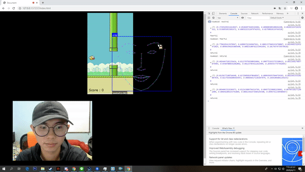

# Version 1.0
## References:
https://github.com/justadudewhohacks/face-api.js/ (face detected)  

https://www.youtube.com/watch?v=L07i4g-zhDA (flappy bird game basic)
## development tools
IDE: Brackets 
# screen shot 

# Issue 
1. Lag (code is NOT optimized)
2. Bad gaming experience (too hard to use face to control)

# demo
https://mumu.tw/FaceBird
